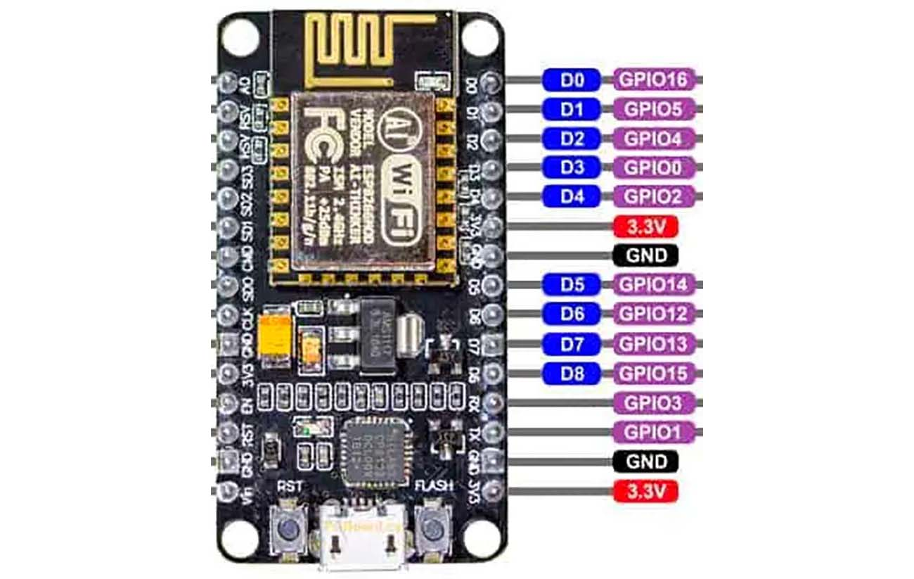

# See how window replacement and morning headaches are related
*If you open the door to your child's room in the morning, you may be surprised at how it is possible to survive a night without air. Especially if you have small rooms and new great sealing windows…*

The purpose of the project is to **measure the concentration of CO2** depending on different ways of air ventilation.
Send and visualize measured data on [tmep.cz](https://tmep.cz/) (Statistics for measured values from IOT devices).

Optionally measure humidity and temperature provided by the sensor.

The project is small and if you have experience, you are done quickly. For others like me, this brings new insights and can be a good start for IOT prototyping. [See lessons learned](#how-it-went-really).

## Hardware
* NodeMCU ESP8266 WiFi board
* SCD30 sensor
* Jumper wires 4 x

## Sofware 
* VS Code
* [PlatformIO IDE extension](https://platformio.org/platformio-ide)
* [SparkFun SCD30 CO₂ Sensor Library](https://github.com/sparkfun/SparkFun_SCD30_Arduino_Library)
* If developing on windows you will need to install driver - [CP210x USB to UART Bridge Virtual COM Port](https://www.silabs.com/developers/usb-to-uart-bridge-vcp-drivers)

 

### SCD30 PIN diagram

### Amica NodeMCU ESP8266 WiFi board diagram

### Connect jumper wires
To be able to connect wires to sensor you may have to do a little soldering first or use breadboard.
1. Red - sensor VDD (power) to board 3V3
2. Black - sensor GND to board GND
3. Yellow - sensor SCL to board D1
4. Blue - sensor SDA to board D2

 

## What are safe levels of CO2 in rooms?
| CO2 concentration  |  |
| ------------- | ------------- |
| 250-400 ppm| Normal background concentration in outdoor ambient air
| 400-1,000 ppm| Concentrations typical of occupied indoor spaces with good air exchange
| 1,000-2,000 ppm | Complaints of drowsiness and poor air.
| 2,000-5,000 ppm| Headaches, sleepiness and stagnant, stale, stuffy air. Poor concentration, loss of attention, increased heart rate and slight nausea may also be present.
| 5,000 ppm| Workplace exposure limit (as 8-hour TWA) in most jurisdictions.
| >40,000 ppm| Exposure may lead to serious oxygen deprivation resulting in permanent brain damage, coma, even death.

## Measurement results

## How it went really

Arduino Uno

1. Started with Arduino Uno. Found its PIN diagram, connected board to SCD30 sensor using jump wires.
2. Installed PlatformIO IDE as VS Code extension and created *Hello World* project, compiled and deployed to board and voila!
3. Found an SCD30 example at Sparkfun blog and started to read and print sensor values.
4. Realized I have no idea how to store or send the data anywhere :smile:

Let's try NodeMCU ESP8266 WiFi board

1. Learned the board PIN diagram and reconnected jump wires.
2. Created a new project but failed to print data to terminal (serial port).
3. Found and installed CP210x USB universal driver for Windows. That fixed it.
4. Started program, connected to my WiFi router but could not send a GET http request to tmep.cz (receiving connection errors).
5. Tried different ways of handling wificlient, httpclient, headers, connection reuse etc. using examples from the Internet. With no success.
6. Had another coffee and decided to try different board

How about Adafruit HUZZAH ESP8266?

1. New project, new PIN diagram, reconnected wires and bam, printing to COM failed again. None of the provided USB drivers worked. The COM port would not start at all.
2. Went to MacBook Air, installed all and eventually was able to print data to terminal.
3. But also found my WiFi router had problem with GET to tmep.cz. Other urls worked just fine :raised_eyebrow: So I tried to use mobile hotspot instead and sent requests to tmep.cz successfully.

Back to NodeMCU ESP8266 :wink:

1. Reconnected sensor back to this board
2. Finally was able to measure an send data to tmep.cz. :sunglasses:

